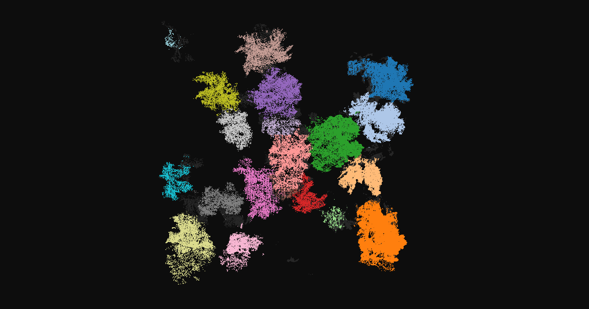
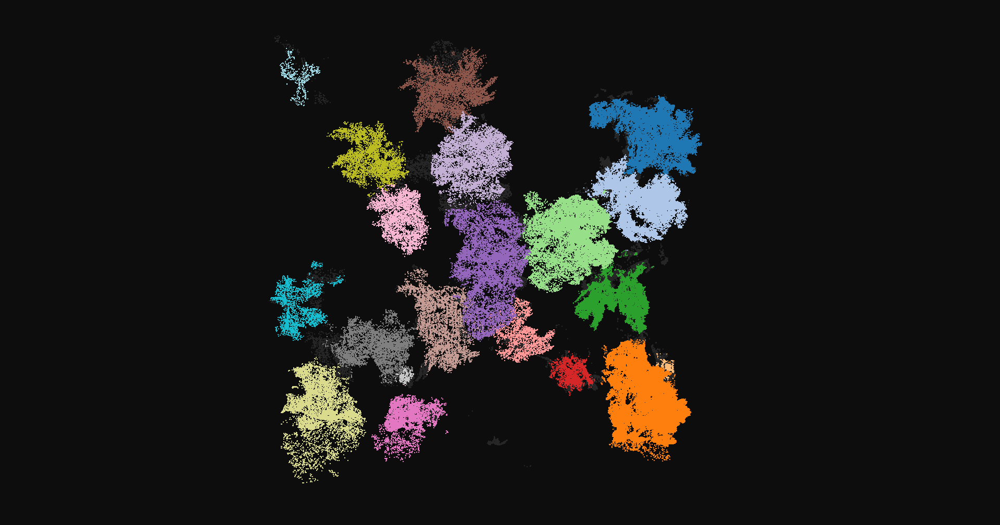
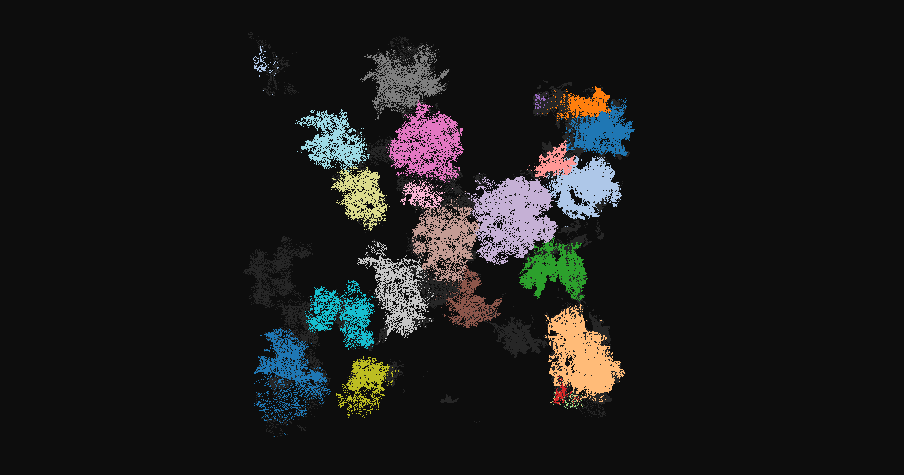
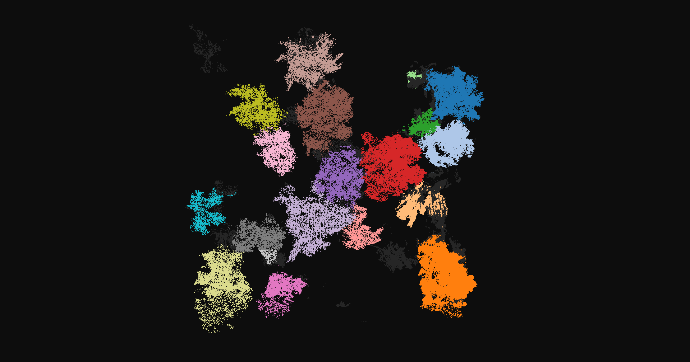

# ForestVolumeSeg

> **Code for the paper:**  
> *"Impact of Manual Annotation Refinement on Instance Segmentation Accuracy in UAV-LiDAR-Based Forest Inventories"*  
> Adrián Canovas-Rodriguez, Guillermo Carmona-Martinez, Aurora Gonzalez-Vidal, Antonio Skarmeta  
> Department of Information and Communications Engineering, Universidad de Murcia

---

## Abstract

Accurate estimation of Above-Ground Biomass (AGB) is crucial for forest monitoring. Manual annotation methods are too labor-intensive, while fully automated labeling pipelines leave model performance quality as an open question. This study evaluates two state-of-the-art deep learning architectures — **OA-CNN** and **PT-v3** — for individual tree detection (ITD) and AGB estimation from UAV-LiDAR point clouds, under five training configurations that progressively replace automated labels with manually refined ones. Results show that OA-CNN outperforms the other models, and that with only 50% manually labeled data it achieves **56.51% AP25** and **61.31% mWCov**, indicating that a hybrid labeling strategy can close most of the gap between costly full manual annotation and fully automated processing.

---

## Study area

The dataset covers the **Santomera Reservoir basin** (38.101° N, 1.109° W), Region of Murcia, southeastern Spain — a semi-arid Mediterranean territory spanning ~120 hectares, where forests constitute 44.6% of regional land use.


---

## Pipeline

```
UAV flight (DJI Zenmuse L2, 120 m altitude)
        │
        ▼
  Raw .las files  →  20 × 20 m tiles (4 276 total)
        │
        ▼
  CSF Terrain Filter  →  tree-only point cloud tiles
        │
   ┌────┴────────────────┐
   │                     │
Manual labeling       Automated labeling
(32 plots, 380 trees)  (380 trees via CloudCompare)
   └────────┬────────────┘
            │
            ▼
  Five training scenarios (0 / 25 / 50 / 100 / ML %)
            │
            ▼
  Pointcept training (OA-CNN / PT-v3 / SpUNet)
  + PointGroup instance head
            │
            ▼
  Predicted instance masks (.pth)
            │
            ▼
  DTM normalization (CSF)  +  Crown diameter (alpha-shape)
            │
            ▼
  Allometric equation  →  AGB per tree (kg)
```

---

## Dataset

LiDAR data were acquired with a **DJI Zenmuse L2** sensor mounted on a DJI drone at 120 m AGL, achieving 4 cm vertical and 5 cm horizontal accuracy. Post-processing in DJI Terra produced 4,276 georeferenced 20 × 20 m tiles.

### Training scenarios

Five configurations were tested by varying the proportion of manually refined labels:

| Scenario | Automated trees | Manual trees | Total |
|---|---|---|---|
| 0% | 380 | 0 | 380 |
| 25% | 380 | 95 | 475 |
| 50% | 380 | 190 | 570 |
| 100% | 380 | 380 | 760 |
| ML (manual only) | 0 | 380 | 380 |

---

## Models

All deep learning models use the [Pointcept](https://github.com/Pointcept/Pointcept) framework with a **PointGroup** instance segmentation head (PG-v1m2) on top of three different backbones:

| Model | Backbone | Key property |
|---|---|---|
| **OA-CNN** | Omni-Adaptive Sparse CNN | Adaptive receptive field; captures features at multiple scales |
| **PT-v3** | Point Transformer v3 | Vector self-attention; captures long-range dependencies |
| **SpUNet** | Sparse U-Net v1m1 | Sparse convolutions on occupied voxels only |
| **Watershed** *(baseline)* | CHM-based flooding | Traditional rasterized method; prone to under/over-segmentation |

---

## Results

OA-CNN results on the Santomera test set:

| Architecture | Config | Sem. IoU | mWCov | AP50 | AP25 | AGB (Mg) | Trees |
|---|---|---|---|---|---|---|---|
| **OA-CNN** | 0% | 79.09 | 66.43 | 25.76 | 41.76 | 13.74 | 211 |
| **OA-CNN** | 25% | 83.69 | 71.57 | 30.26 | 39.55 | 13.25 | 215 |
| **OA-CNN** | **50%** | 72.93 | 61.31 | 35.96 | **56.51** | 12.98 | 180 |
| **OA-CNN** | 100% | 83.64 | 72.24 | 40.92 | 54.91 | 13.18 | 170 |
| **OA-CNN** | ML | 77.31 | 70.90 | **52.34** | 72.89 | 12.47 | 132 |

**Key takeaway:**
- The **50% hybrid configuration** reached the best AP25 (56.51%), showing that a mixed dataset reduces annotation cost without sacrificing detection breadth.

### Qualitative segmentation progression (OA-CNN)

Each image shows a test plot with individual trees coloured by predicted instance. Gray points are background (non-tree). Comparing across label ratios reveals the direct impact of manual annotation quality on segmentation behaviour.

<table>
  <tr>
    <td align="center"><b>0% manual labels</b></td>
    <td align="center"><b>25% manual labels</b></td>
  </tr>
  <tr>
    <td></td>
    <td></td>
  </tr>
  <tr>
    <td align="center"><b>50% manual labels</b></td>
    <td align="center"><b>100% manual labels</b></td>
  </tr>
  <tr>
    <td></td>
    <td></td>
  </tr>
</table>

**Effect of manual labels on segmentation quality:**

At **0%** (automated labels only) the model heavily oversegments: single large trees are broken into several small, disconnected fragments each assigned a different colour. At **25%** this fragmentation persists, particularly in the dense central cluster where overlapping crowns confuse boundaries drawn from automated labels alone.

From **50%** onward the qualitative picture changes substantially. Each coloured blob grows larger and more circular, matching the true spatial footprint of a single crown. By **100%** the predicted crowns fill out their full 3D extent — trunk, branches, and outer canopy are consistently grouped under one label — producing compact, well-rounded shapes that closely resemble the ground-truth layout.

---

## AGB estimation

For each predicted tree instance the pipeline:

1. Builds a **Digital Terrain Model (DTM)** via CSF and normalises point heights
2. Computes tree **height H** (max normalised height in the instance)
3. Computes **crown diameter CD** via a 2D concave hull (alpha-shape) of the projected footprint: `CD = 2 × sqrt(area / π)`
4. Applies the allometric equation:

```
AGB = (α + αG) × (H × CD)^(β + βG) × exp(σ² / 2)
```

where α, αG, β, βG are species-type constants and the exponential term is a log-space correction factor.

See `Notebooks/calculateAGB.ipynb` for the full implementation.

---

## Code description

### `Scripts/treeSegWatershed.py`

Classical watershed baseline for individual tree detection. Loads a LAS tile, applies CSF to separate terrain from vegetation, interpolates a Canopy Height Model (CHM) from above-ground heights, detects crown peaks using a **Variable Window Filter** (window size scales with tree height via `3 + 0.00901 × h²`), and runs the watershed flood algorithm on the inverted CHM. Resulting clusters are then filtered by **sphericity** (ratio of smallest to largest PCA eigenvalue) to discard non-tree objects such as bushes. Final tree instances and heights are saved to `trees_detected.csv`.

Key functions: `get_variable_window_size`, `apply_vwf`, `segment_terrain_points`, `create_chm`, `apply_watershed`, `analyze_geometric_features`, `classify_tree_watershed`.

---

### `Scripts/utilsLAS.py`

Utility library for working with LAS/LAZ point cloud files.

| Function | Purpose |
|---|---|
| `inspect_header` | Prints version, point format, point count, scales, offsets, and real XY extents of a LAS file |
| `visualize_lidar_3d` | Opens an interactive Open3D window with the cloud coloured by elevation (jet colormap), centred at the origin |
| `visualize_lidar_rgb` | Opens an interactive Open3D window using the file's 16-bit RGB values, subsampled to 1 M points |
| `convert_las_to_assets` | Converts a labeled LAS tile into the `.npy` asset files Pointcept expects: `coord.npy`, `color.npy`, `intensity.npy`, `segment.npy`, `instance.npy`. Tree/background class is derived from LAS classification (≥ 3 → tree) |
| `convert_las_to_assets_conference` | Same as above but reads instance IDs from a custom `intermediate_segs` extra dimension written by the CloudCompare automated labeling plugin |

---

### `Scripts/pointcept/train/`

Pointcept configuration files for the three DL models. Each file fully specifies the training run: optimizer (AdamW, lr=0.002), scheduler (OneCycleLR, 175 epochs), backbone architecture, PointGroup instance head parameters, and the data augmentation pipeline (random rotation, scale, jitter, flip, chromatic transforms, 0.05 m grid sampling).

| File | Backbone |
|---|---|
| `arboles_instance_train_ptv3.py` | Point Transformer v3 |
| `arboles_instance_train_spunet.py` | Sparse U-Net v1m1 |
| `arboles_instance_train_oacnn.py` | OA-CNN v1m1 |

---

### `Scripts/pointcept/test/`

Inference counterparts to the training configs.

| File | Model |
|---|---|
| `arboles_instance_test_ptv3.py` | PT-v3 |
| `arboles_instance_test_spunet.py` | SpUNet |
| `arboles_instance_test_oacnn.py` | OA-CNN |

---

### `Scripts/pointcept/run_scripts/`

Shell scripts that automate the full experiment loop across all five dataset variants (`trees_0`, `trees_25`, `trees_50`, `trees_100`, `trees_ML`). For each variant, `sed` patches `data_root`, `save_path`, and `weight` directly in the train and test config files, then calls `tools/train.py` followed by `tools/test.py` in sequence.

| File | Model |
|---|---|
| `run_ptv3.sh` | PT-v3 |
| `run_spunet.sh` | SpUNet |
| `run_oacnn.sh` | OA-CNN |

---

### `Scripts/pointcept/modified_source_files/`

Patched Pointcept source files that must overwrite the originals inside the Pointcept installation before running any experiment.

| File | Change |
|---|---|
| `datasets/defaults.py` | Adds `"intensity"` to `VALID_ASSETS` so the loader accepts intensity `.npy` files |
| `datasets/transform.py` | Adds `"intensity"` to `index_valid_keys` in `index_operator` so intensity survives cropping/sampling transforms |
| `models/point_group/point_group_v1m2_custom_criteria.py` | Registers a custom PointGroup variant as `PG-v1m2` with modified loss weighting for the tree/background binary task |
| `models/oacnns/oacnns_v1m1_base.py` | Allows the architecture to be used as a backbone |
| `engines/test.py` | Replaces the default tester with `InsSegTester`, which saves per-tile `pred_masks` tensors as `.pth` files for downstream AGB computation |

---

### `Notebooks/calculateAGB.ipynb`

End-to-end AGB estimation notebook. Iterates over all model/scenario combinations, loading each tile's `.pth` prediction file and the matching `.las` source. For each predicted tree instance it: (1) builds a DTM via CSF and normalises heights, (2) computes max tree height H, (3) projects the instance to 2D and fits an alpha-shape hull to derive crown diameter CD, (4) applies the allometric equation. Outputs a per-model summary of total AGB (Mg) and tree count.

---

### `Notebooks/watershedProcessing.ipynb`

Applies the watershed baseline (`treeSegWatershed.py`) to all test tiles and collects per-tile tree counts and AGB estimates, providing the classical-method numbers reported in the results table.

---

### `Notebooks/preprocess-LAS.ipynb`

Preprocessing pipeline that calls `convert_las_to_assets` / `convert_las_to_assets_conference` to convert the 32 labeled LAS tiles into the `.npy` asset directories consumed by Pointcept's `DefaultDataset`, and assembles the five dataset splits for each training scenario.

---

### `Notebooks/pointceptMetrics.ipynb`

Computes the semantic IoU, mWCov, AP50, and AP25 metrics reported in the results table by comparing Pointcept's `.pth` prediction files against the ground-truth instance labels.

---

### `Notebooks/GlobalEvaluator2.py`

Helper module imported by `pointceptMetrics.ipynb`. Implements the mWCov and AP calculation logic, including IoU matching between predicted and ground-truth instance masks.

---

### `Notebooks/visualizeResults.ipynb`

Generates the point-cloud renders in `Visualizations/ForestSegResults/` by loading prediction `.pth` files, assigning a random colour per instance, and saving top-down screenshots via Open3D.

---

### Repository layout

```
ForestVolumeSeg/
├── Scripts/
│   ├── treeSegWatershed.py
│   ├── utilsLAS.py
│   └── pointcept/
│       ├── train/                        # arboles_instance_train_{ptv3,spunet,oacnn}.py
│       ├── test/                         # arboles_instance_test_{ptv3,spunet,oacnn}.py
│       ├── run_scripts/                  # run_{ptv3,spunet,oacnn}.sh
│       └── modified_source_files/
│           └── pointcept/
│               ├── datasets/             # defaults.py, transform.py
│               ├── engines/              # test.py
│               └── models/
│                   ├── oacnns/           # oacnns_v1m1_base.py
│                   └── point_group/      # point_group_v1m2_custom_criteria.py
├── Notebooks/
│   ├── calculateAGB.ipynb
│   ├── watershedProcessing.ipynb
│   ├── preprocess-LAS.ipynb
│   ├── pointceptMetrics.ipynb
│   ├── GlobalEvaluator2.py
│   └── visualizeResults.ipynb
├── Visualizations/
│   ├── ForestSegResults/                 # 0.png  25.png  50.png  100.png  GT.png
│   └── geospatial/                       # aoi.png  aoi.qgz
└── requirements.txt
```

---

## Installation

### 1. Python environment

```bash
pip install -r requirements.txt
```

Key dependencies: `torch==2.10.0+cu128` (CUDA 12.8), `open3d`, `laspy`, `alphashape`, `scipy`, `cloth_simulation_filter`.

### 2. Pointcept

```bash
git clone https://github.com/Pointcept/Pointcept.git
cd Pointcept
pip install -e .
```

### 3. Apply custom patches

Copy the modified source files over the Pointcept installation **before** running any experiment:

```bash
cp -r Scripts/pointcept/modified_source_files/pointcept/* <path-to-pointcept>/pointcept/
```

---

## Data structure

```
data/
├── trees_0/
│   ├── train/     # .npy tiles 
│   └── test/      # .npy tiles 
├── trees_25/
│   ├── train/     # .npy tiles 
│   └── test/      # .npy tiles 
...
├── trees_ML/
│   ├── train/     # .npy tiles 
│   └── test/      # .npy tiles
└── Santomera/
    ├── tiles/trees/labeled/
    ├── tiles/trees/unlabeled/
    ├── tiles/terrain/
    └── result/
        ├── OACNN/      # .pth — one file per tile, key: pred_masks [N_inst, N_pts]
        ├── PT-v3/
        └── SpUNET/
```

---

## Training & inference

Copy config files to Pointcept's `configs/` directory, then run from the Pointcept repo root.

### Manual

```bash
python tools/train.py --config-file configs/arboles_instance_train_ptv3.py --num-gpus 1
python tools/test.py  --config-file configs/arboles_instance_test_ptv3.py  --num-gpus 1
```

### Automated

```bash
bash Scripts/pointcept/run_scripts/run_oacnn.sh
bash Scripts/pointcept/run_scripts/run_ptv3.sh
bash Scripts/pointcept/run_scripts/run_spunet.sh
```

### Key hyperparameters

| Parameter | Value | Description |
|---|---|---|
| `voxel_size` | 0.05 m | Grid-sampling resolution |
| `in_channels` | 6 | XYZ + RGB |
| `cluster_thresh` | 2.0 m | Ball-query BFS radius |
| `cluster_min_points` | 120 | Minimum points per instance |
| Optimizer | AdamW | lr=0.002, weight_decay=0.005 |
| Scheduler | OneCycleLR | 175 epochs, pct_start=0.05 |

---

## Citation

If you use this code or dataset, please cite:

```bibtex
@inproceedings{canovas2025forestvolumeseg,
  title     = {Impact of Manual Annotation Refinement on Instance Segmentation Accuracy
               in UAV-LiDAR-Based Forest Inventories},
  author    = {Canovas-Rodriguez, Adri\'{a}n and Carmona-Martinez, Guillermo and
               Gonzalez-Vidal, Aurora and Skarmeta, Antonio},
  booktitle = {},
  year      = {2025}
}
```

This work also builds on:

- **Pointcept** — Wu et al., [https://github.com/Pointcept/Pointcept](https://github.com/Pointcept/Pointcept)
- **Jucker et al. (2017)** — *Allometric equations for integrating remote sensing imagery into forest monitoring programmes.* Global Change Biology, 23(1), 177–190.
- **Zhang et al. (2016)** — *A Simple, Efficient, and Robust Approach for Ground Points Filtering from Lidar Data (CSF).* Remote Sensing, 8(6), 501.
- **Wu et al. (2024)** — *Point Transformer v3: Simpler Faster Stronger.* CVPR 2024.
- **Peng et al. (2024)** — *OA-CNNs: Omni-Adaptive Sparse CNNs for 3D Semantic Segmentation.* CVPR 2024.

---

## Acknowledgements

This study was partially funded by the **Ramon y Cajal Program** of the Spanish State Research Agency (AEI) under Grant RYC2023-043553-I, and by the **Spanish Ministry for Digital Transformation and the Civil Service** under Grant TSI-100921-2023-1 (Cátedra OSIRIS: Transformación Digital Basado en IA del Ecosistema Agrícola del Sureste Español).
